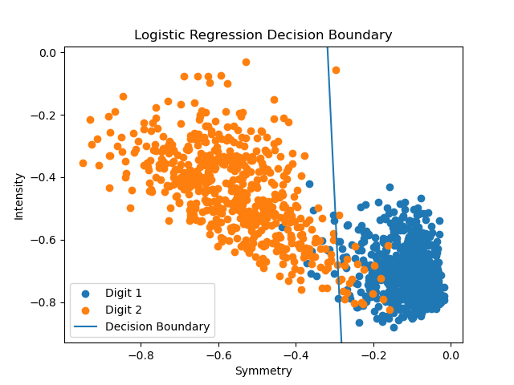
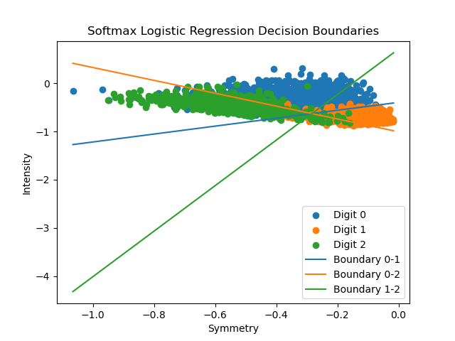
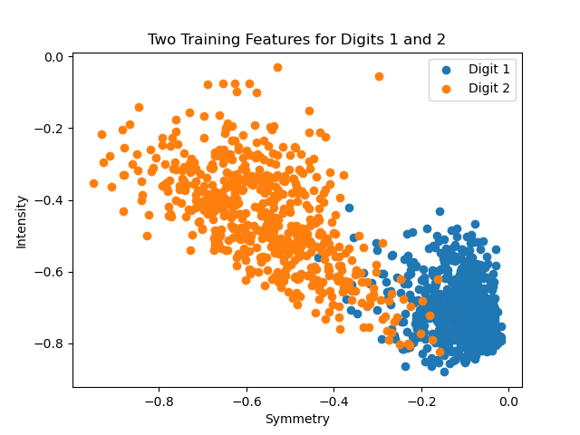

# Logistic Regression from Scratch

A NumPy implementation of binary and multiclass logistic regression for
handwritten digit classification.

This project explores the mathematical foundations of logistic regression
by implementing the models and optimization algorithms from scratch rather
than relying on machine learning libraries for training.

## Features

- Binary logistic regression using the sigmoid function
- Multiclass logistic regression using softmax
- Batch Gradient Descent (BGD)
- Stochastic Gradient Descent (SGD)
- Mini-Batch Gradient Descent
- Cross-entropy gradient computation
- Hyperparameter tuning using validation accuracy
- Hand-engineered symmetry and intensity image features
- Visualization of learned decision boundaries

## Feature Engineering

Each 16×16 digit image is represented using two features:

**Symmetry** — measures the difference between an image and its
horizontally flipped version.

**Intensity** — measures the total pixel intensity of the image.

A bias term is also included for the logistic regression models.

## Binary Classification

The binary classifier distinguishes handwritten digits 1 and 2 using
sigmoid logistic regression.



The model learns a linear decision boundary based on the symmetry and
intensity features.

## Multiclass Classification

Softmax logistic regression extends the model to classify digits 0, 1,
and 2.



Pairwise decision boundaries illustrate how the learned linear models
separate the three digit classes.

## Training Features



The visualization shows the distribution of digits 1 and 2 in the
two-dimensional feature space.

## Hyperparameter Tuning

Models are evaluated across different learning rates and training
iterations. Validation accuracy is used to select the best-performing
configuration before evaluating it on the test set.

## Technologies

- Python
- NumPy
- Matplotlib

## Running the Project

Install the dependencies:

```bash
pip install -r requirements.txt